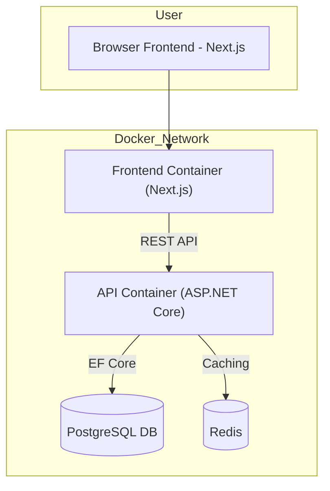
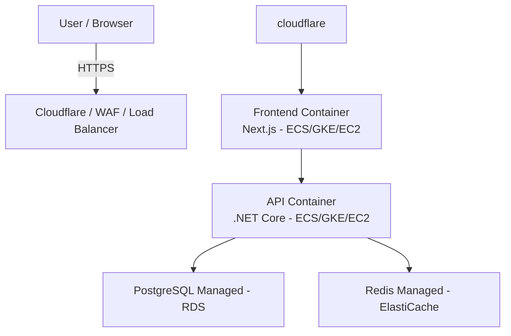
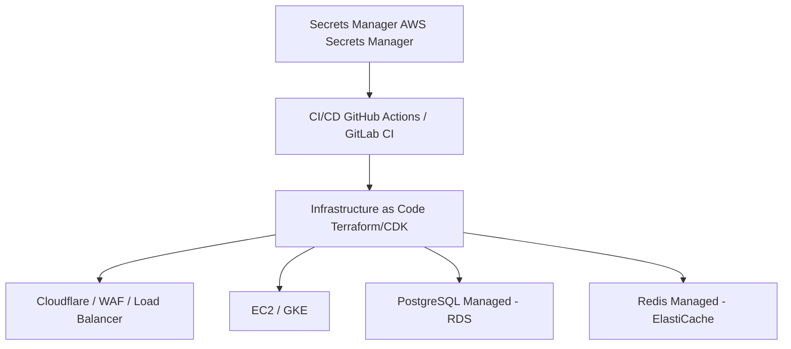

# VibeTools Documentation

## Project Overview

VibeTools is a simple full-stack web application where users can:

* Browse and search for AI tools.
* Submit new tools.
* Leave reviews.

It consists of a frontend (Next.js + Tailwind + Shadcn), an API (ASP.NET Core 8 with EF Core), PostgreSQL, Redis, and
runs fully inside Docker.

---

## Architecture Diagram (System + Infrastructure)




If Mermaid flowcharts are not supported in your markdown viewer, please
visit the rendered flowchart is available [here](https://mermaid.live/edit#pako:eNptkstuwjAQRX_FmhVIIUoCTkgWSDylSi2iQDclqDLEQEpjR44jaIF_75BQ6MubGV_PPWOPfICljDgEsFYs3ZBpLxQEV5YvSuEp46qUzmuh5A6FWaeMZKCk0FxEpEaGfK_N12xeFqMWil-onlxuuXoZcr2TavsHSmq1FlldgLMQruwuRhYLrKhcmlRDmN_8q-slaq3juD-Zkvbo7khYGiMF0--A9mRkDvtTlBT_ScHyAtAfFIdHkspMrxXPZpVRmU0e70mvU_3H02XLTSzWR6J4FKNhfA7V2yjAwPHGEQRa5dyAhKuEnbdwOJeEoDc84SEEmEYMRwOhOKEnZeJZyuTLpmS-3kCwYm8Z7vI0Ypr3YobDTa6qwm5cdWUuNAS2bxcQCA6wh8Cpu2bT8X3Xshyv4djUMeAdggY1m55VdymlDde3PHoy4KNoa5sW9W3foRb1bLfuNz0D8GVaqofyzxRf5_QJxr-zNw)


## Setup Instructions (Docker Compose)

### Prerequisites

* Docker
* Docker Compose

### Folder Structure

```
project-root/
├── Dockerfile.api
├── Dockerfile.frontend
├── docker-compose.yml
├── VibeTools.Api/
│   ├── backend code
├── frontend/
    ├── frontend code
```

### Run the Project

Clone the project and then run the below commands:

```bash
cd ~/path/to/project/directory/root
docker compose up --build
```

This will bring up 4 countaiers
* Frontend: [http://localhost:3000](http://localhost:3000)
* API: [http://localhost:5000](http://localhost:5000)
* PostgreSQL: localhost:5432 (via Docker)
* Redis: Service not exposes

**Note:** Services exposed for ease of access. In a production setup the api and frontend services will be
placed behind a reverse proxy and/or load-balancer. DB access should be restricted to api only unless external
access needed (read only preferably)

### API Testing

Use Postman or curl to hit the endpoints like:

```bash
curl http://localhost:5000/tools
```

---
## Cloud Hosting Architecture (Overview)
When hosted in the cloud (e.g. AWS, Azure, GCP), the system architecture could look something like this:

### Containers per Service:
  Each service (API, frontend) runs in its own container, deployed to individual compute instances/containers (e.g. EC2, GKE Pods, App Services). This allows for:
* Independent scaling and fault tolerance
* Fine-grained deployment pipelines per service

### Managed Services:
* **PostgreSQL** and **Redis** are offloaded to managed services (e.g. RDS, Amazon ElastiCache) for:
    * Built-in backup/restore
    * Automatic patching and high availability
    * Better observability and operational support

### Networking Layer:
* The system is fronted by a **reverse proxy** or **Application Load Balancer** that:
    * Routes HTTP(S) traffic to the appropriate container/service
    * Enforces WAF/firewall rules (e.g. Cloudflare, AWS WAF)

### Scalability & Reliability:
* Use **horizontal scaling** (auto-scaling groups or Kubernetes) for API and frontend
* Stateless design for all containers ensures they can scale easily

### Security:
* Secrets and connection strings are injected via **environment variables** using a secrets manager (e.g. AWS Secrets Manager, HashiCorp Vault)
* All external traffic uses HTTPS

### CI/CD:
* Infrastructure as Code (IaC) via Terraform or AWS CDK
* GitHub Actions/GitLab CI for automated Docker builds, tests, and deployments

### Interaction/Service Flowchart



### Infrastructure Flowchart
